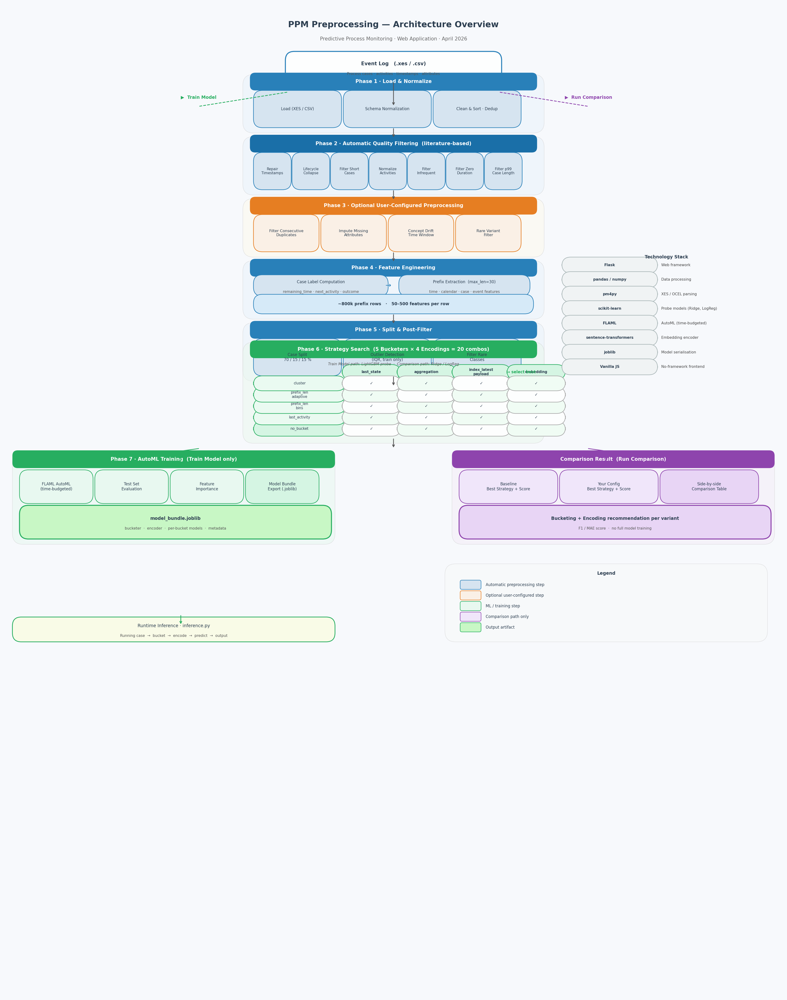

# Architecture Overview
## PPM Preprocessing Web Application

**Author:** Fedey
**Status:** Draft
**Version:** 1.0
**Date:** April 2026

---



> *Generated by `generate_architecture_diagram.py`*

---

## 1. Scope and Purpose

This document describes the architecture of the **PPM Preprocessing** system — a web-based tool that transforms raw business process event logs into trained predictive models for **Predictive Process Monitoring (PPM)**.

The system sits in the preprocessing and model selection phase of the PPM lifecycle. A practitioner uploads an event log, configures task-specific options, and the system produces a serialized model bundle ready for deployment as a real-time prediction service.

**Out of scope:** The deployed prediction service itself (inference API), visualization dashboards, and process discovery.

---

## 2. Stakeholders and Concerns

Following the CAFCR framework:

| Stakeholder | Primary Concerns |
|---|---|
| **Process analyst / researcher** | Which preprocessing configuration gives the best predictive accuracy? How do different bucketing/encoding strategies compare? |
| **Data scientist** | Is the feature engineering correct? Is there data leakage? Are train/val/test splits clean? |
| **Process owner / manager** | How long will a running case take? What is the next activity? What is the likely outcome? |
| **Thesis author** | Reproducibility of experiments; clear separation of pipeline steps for academic writing; runtime of the comparison tool. |
| **System maintainer** | Adding new steps or strategies without breaking existing ones; session isolation between users. |

---

## 3. Customer Objectives (Why)

### 3.1 Core Problem

Training a PPM model by hand requires:
1. Parsing event logs (XES or CSV)
2. Normalizing schema inconsistencies
3. Filtering noise (short cases, zero-duration, rare activities, etc.)
4. Engineering features from prefix sequences
5. Selecting a bucketing and encoding strategy
6. Running AutoML and evaluating on a held-out test set

This process is error-prone, slow, and requires expert knowledge. The system automates it end-to-end.

### 3.2 Key Quantities

| Metric | Typical Value |
|---|---|
| Event log size | 10 k – 500 k cases |
| Events per case | 5 – 100 |
| Prefix rows generated | up to ~800 k rows (55 k cases × avg. 15 prefix length) |
| Bucketing strategies tested | 5 |
| Encoding strategies tested | 4 |
| Strategy combinations | 20 per variant |
| AutoML time budget | 60 – 600 s (user-configured) |
| Supported tasks | 4 (remaining time, next activity, outcome, custom attribute) |

### 3.3 Use Cases

1. **Train Model** — Full pipeline from raw log to deployed model bundle.
2. **Run Comparison** — Fast side-by-side strategy search for two preprocessing configurations (no AutoML training, linear probe models).
3. **Runtime Inference** — Predict on a running case using an exported model bundle.

---

## 4. Application View (What the user does)

The web interface is a single-page application structured as a three-step wizard:

```
Step 1: Upload & Configure
  → Upload XES or CSV file
  → Select prediction task
  → Set split ratios, max prefix length, AutoML budget
  → Configure optional preprocessing (dedup, impute, drift window, etc.)
  → Map custom column names

Step 2: Preview
  → Inspect detected column mapping
  → Confirm or adjust configuration

Step 3a: Train Model
  → Run full pipeline (preprocessing → strategy search → AutoML)
  → Watch pipeline steps cards appear in real-time
  → Download model bundle (.joblib)

Step 3b: Run Comparison (optional)
  → Configure a second "Your Config" variant
  → Run preprocessing + linear strategy search for both variants
  → Compare best strategy score side-by-side with step visualization
```

---

## 5. Functional View (What the system does)

### 5.1 Pipeline Architecture

The system uses a **linear, context-passing pipeline** built from composable `Step` objects:

```
Event Log (XES / CSV)
      │
      ▼
┌─────────────────────────────────────────────────────┐
│  Phase 1: Load & Normalize                          │
│  LoadStep → NormalizeSchemaStep → CleanSortStep     │
└─────────────────────────────────────────────────────┘
      │
      ▼
┌─────────────────────────────────────────────────────┐
│  Phase 2: Automatic Quality Filtering               │
│  Dedup → RepairTimestamps → LifecycleCollapse        │
│  → FilterShortCases → NormalizeActivities            │
│  → FilterInfrequent → FilterZeroDuration             │
│  → FilterCaseLength                                  │
└─────────────────────────────────────────────────────┘
      │
      ▼
┌─────────────────────────────────────────────────────┐
│  Phase 3: Optional User-Configured Preprocessing    │
│  FilterConsecutiveDuplicates? → ImputeMissing?       │
│  → ConceptDriftWindow? → FilterRareVariants?         │
└─────────────────────────────────────────────────────┘
      │
      ▼
┌─────────────────────────────────────────────────────┐
│  Phase 4: Feature Engineering                       │
│  CaseLabels → PrefixExtraction                       │
│  (adds time, calendar, case, event features)         │
└─────────────────────────────────────────────────────┘
      │
      ▼
┌─────────────────────────────────────────────────────┐
│  Phase 5: Split & Post-Filter                        │
│  CaseSplit → OutlierDetection → FilterRareClasses    │
└─────────────────────────────────────────────────────┘
      │
      ▼
┌─────────────────────────────────────────────────────┐
│  Phase 6: Strategy Search (20 combinations)         │
│  For each bucketer × encoder:                        │
│    Bucket → Encode → Train probe → Evaluate         │
│  → Select best                                       │
└─────────────────────────────────────────────────────┘
      │
      ▼
┌─────────────────────────────────────────────────────┐
│  Phase 7: AutoML Training  [Train Model only]       │
│  FLAML on best bucketing/encoding                    │
│  → Test evaluation → Feature importance              │
│  → Report → Model bundle export                      │
└─────────────────────────────────────────────────────┘
```

### 5.2 Prediction Tasks

| Task | Type | Target label | Primary metric |
|---|---|---|---|
| `remaining_time` | Regression | seconds until case end | MAE |
| `next_activity` | Multiclass classification | next activity name | F1 macro |
| `outcome` | Multiclass classification | user-defined outcome column | F1 macro |
| `next_<attr>` | Multiclass classification | any next event attribute | F1 macro |

### 5.3 Strategy Space (Bucketing × Encoding)

**Bucketing** determines how prefixes are grouped — one model is trained per bucket.

| Strategy | Principle |
|---|---|
| `no_bucket` | Single global model across all prefixes |
| `prefix_len_bins` | Fixed-width bins on prefix length (e.g., 1–5, 6–10, …) |
| `prefix_len_adaptive` | Adaptive bins following the data distribution |
| `last_activity` | One bucket per last activity in the prefix |
| `cluster` | K-means clustering on activity frequency vectors |

**Encoding** transforms a variable-length prefix into a fixed-size feature vector.

| Strategy | Features |
|---|---|
| `last_state` | Final snapshot of case/event attributes |
| `aggregation` | Activity frequency counts + case/event attributes |
| `index_latest_payload` | Positional activity encoding + latest state |
| `embedding` | Sentence-transformer embeddings (mean + last pooling) |

All combinations include engineered time features: elapsed time, time since last event, log-scaled versions, and calendar features (hour, weekday, month, is-weekend).

---

## 6. Conceptual View (Key Design Decisions)

### 6.1 Context-Passing Pipeline Pattern

Every step receives a `PipelineContext` and returns a modified copy:

```python
class Step(ABC):
    def run(self, ctx: PipelineContext) -> PipelineContext: ...

@dataclass
class PipelineContext:
    input_path: str
    task: str
    log: Optional[CanonicalLog]      # current DataFrame
    artifacts: Dict[str, Any]        # step outputs (QC, models, splits, …)
```

**Rationale:** Steps are decoupled from each other. Each step writes to `ctx.artifacts` under a namespaced key (e.g., `filter_short_cases_qc`). The pipeline runner can skip, reorder, or add steps without modifying existing ones.

### 6.2 Leakage-Free Evaluation

A critical design constraint is preventing data leakage:

- Bucketers are **fitted on train cases only**, then applied to val/test.
- Encoders are **fitted on train cases only**.
- Outlier detection is applied to the **train set only**, leaving val/test clean.
- Rare class filtering removes classes from the **train/val set**, not the test set.
- Case splits happen **after** prefix extraction to avoid any label bleed.

### 6.3 Probe Model vs. AutoML Model

The system uses two different model tiers:

| Context | Model | Speed | Accuracy |
|---|---|---|---|
| **Strategy search** (`run_pipeline`) | LightGBM (100 trees) | ~minutes | Good proxy for AutoML |
| **Strategy search** (`run_strategy_search_only`) | Ridge / LogisticRegression | ~seconds | Sufficient for ranking strategies |
| **Final training** | FLAML AutoML ensemble | configurable | Best achievable |

The distinction matters for the **Run Comparison** flow: using Ridge/LogReg for comparison makes it feasible on large logs (55 k cases) without subsampling.

### 6.4 Progress Streaming Protocol

Long-running pipeline steps communicate with the browser via a `__STEP__:` protocol over Server-Sent Events:

```
"__STEP__:{json}" → intercepted by _on_progress()
                  → parsed, stored in session state
                  → returned by /api/status every 3 s
                  → rendered as step cards in the UI
```

Non-step messages are forwarded as plain progress strings.

### 6.5 Session Isolation

Each browser session gets a unique signed session ID. All state — uploaded files, pipeline progress, intermediate artifacts, model bundles — is stored in a session-scoped dictionary with a per-session threading lock. No data is shared between concurrent users.

---

## 7. Realization View (How it is built)

### 7.1 Module Structure

```
src/ppm_preprocessing/
├── webapp/
│   ├── app.py                    Flask app, routes, session management
│   ├── pipeline_runner.py        Orchestrates pipeline execution in threads
│   └── templates/index.html      Single-page UI (HTML + JS, no framework)
│
├── domain/
│   ├── context.py                PipelineContext dataclass
│   └── canonical_log.py          CanonicalLog (DataFrame + metadata)
│
├── steps/                        ~32 pipeline step classes
│   ├── base.py                   Step ABC
│   ├── load_*.py                 Loading steps
│   ├── filter_*.py               Filtering steps
│   ├── prefix_extraction.py      Feature engineering
│   ├── single_task_strategy_search.py
│   ├── single_task_automl_train.py
│   └── ...
│
├── bucketing/                    5 bucketer classes
├── encoders/                     4 encoder classes
├── tasks/specs.py                TaskSpec + build_model() / build_probe_model()
├── automl/flaml_adapter.py       FLAML AutoML adapter
└── inference.py                  Runtime prediction
```

### 7.2 Key Technology Choices

| Concern | Choice | Rationale |
|---|---|---|
| Web framework | Flask (Python) | Lightweight; simple SSE support; familiar |
| Data processing | pandas + numpy | Standard for tabular ML |
| Event log parsing | pm4py | De-facto standard for XES/OCEL |
| ML framework | scikit-learn | Consistent API for all probe models |
| AutoML | FLAML | Fast, supports regression + multiclass, time-budgeted |
| Embeddings | sentence-transformers | Off-the-shelf text embeddings for activity names |
| Model serialization | joblib | Standard for sklearn-compatible bundles |
| Frontend | Vanilla JS (no framework) | Zero build toolchain; self-contained single file |

### 7.3 Data Flow (Numbers)

For a 55 k-case log with avg. 15 events/case and max prefix length 30:

| Stage | Rows | Notes |
|---|---|---|
| Raw event log | ~825 k events | before filtering |
| After filtering | ~750 k events | ~10% removed typically |
| Prefix rows | ~800 k | up to 30 prefixes per case |
| Train set | ~560 k rows | 70% of cases |
| Val set | ~120 k rows | 15% |
| Test set | ~120 k rows | 15% |
| Feature dimensions | 50–500 | depends on encoding and #activities |

### 7.4 Deployment

- **Development:** `python -m ppm_preprocessing.webapp.app` → `http://localhost:5000`
- **Dependencies:** Python ≥ 3.10; FLAML and LightGBM are optional (graceful degradation)
- **Output:** `model_bundle.joblib` (encoder + bucketer + models + metadata dictionary)

---

## 8. Internal Operational View

### 8.1 Two Execution Paths

```
Upload log
     │
     ├── [Train Model]
     │     run_pipeline()
     │     Full pipeline + AutoML
     │     Thread: background worker
     │     Duration: ~5–30 min (55 k cases)
     │
     └── [Run Comparison]
           run_strategy_search_only() × 2 variants
           Preprocessing + linear strategy search only
           Thread: background worker
           Duration: ~5–15 min (55 k cases)
```

### 8.2 Concurrency Model

- Each user session runs pipeline in a dedicated **background thread**.
- Session state is protected by a **per-session threading.Lock**.
- The browser polls `/api/status` every 3 seconds for progress updates.
- No global shared mutable state between sessions.

### 8.3 Known Constraints

| Constraint | Value | Impact |
|---|---|---|
| Max upload size | 500 MB | Large XES logs with many attributes may exceed this |
| Max prefix length | 30 (default) | Longer cases produce very large prefix tables |
| Strategy search time | ~minutes (linear probe) | Acceptable; was ~hours with LightGBM probe |
| AutoML time budget | 300 s (default) | User-configurable; increase for better models |
| Embedding encoding | requires `sentence-transformers` GPU optional | Falls back to CPU; slow on large datasets |

---

## 9. Architecture Decisions Log

| Decision | Alternative Considered | Reason for Choice |
|---|---|---|
| Use Ridge/LogReg for comparison strategy search | LightGBM probe (rejected: too slow on 55k-case logs) | 20 Ridge fits on 800k rows takes seconds; LightGBM took 1.5+ hours |
| Context-passing pipeline vs. data frames | Direct function calls | Steps are testable and composable in isolation |
| Session-based isolation vs. user accounts | Database-backed users | Simpler; no auth required for research tool |
| FLAML vs. auto-sklearn vs. manual grid | Manual grid | FLAML is time-budgeted, supports multiclass, lightweight dependency |
| Single HTML file template | React/Vue SPA | No build toolchain; self-contained; easy to deploy |
| Fit bucketer/encoder on train only | Full dataset fit | Prevents leakage; required for valid evaluation |

---

*This overview covers the essential architecture of the PPM Preprocessing system as of April 2026. It is intended as a 15–20 page academic-style architecture description following the CAFCR framework.*
